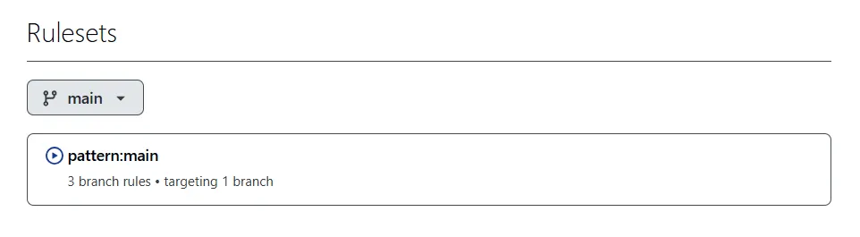
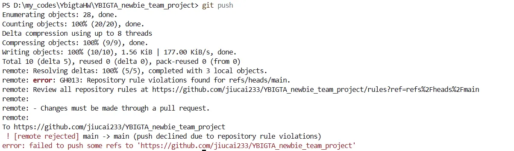
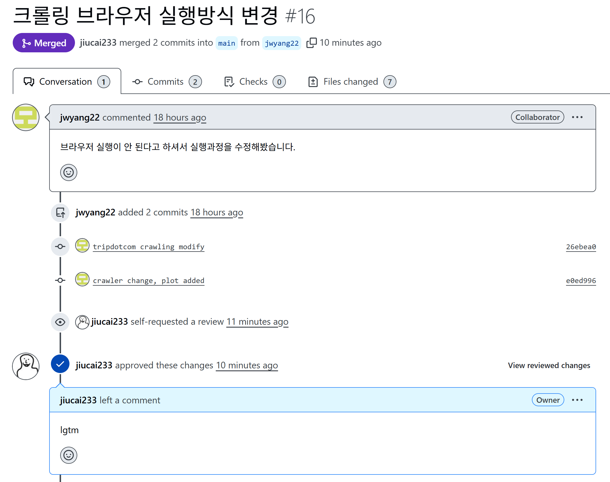

# YBIGTA 4th team
Team lead: 신영군
Team member: 배순은 양진완

# Team Information
we good

# Member Introduction
신영군: YBIGTA 28기 신영군입니다! 반갑습니다  
양진완: YBIGTA 28기 양진완입니다! 화이팅해봐요  
배순은: YBIGTA 28기 배순은입니다! 파이팅입니다ㅠㅠ!  

# Github homework image
branch protection(branch rule)

rejected push request

review and merge


# 코드 실행 방법

## 환경 준비

1. 터미널 또는 Powershell 열기
2. 경로 설정 (YBIGTA_newbie_team_project 루트폴더)
3. 필요한 패키지 설치
```bash
pip install -r requirements.txt
```
## WEB 과제

## 크롤링
```bash
cd review_analysis/crawling
python main.py --output_dir ../../database --all
```

## EDA/FE
```bash
cd review_analysis/preprocessing  
python main.py --output_dir ../../database --all
```

# 데이터 소개 
서울 잠실동에 있는 놀이공원인 '롯데월드'의 리뷰를 세 사이트에서 크롤링 및 분석하고자 하였습니다.  
#### 크롤링한 사이트 링크
   - 구글맵: https://www.google.com/maps/place/Lotte+World/data=!4m12!1m2!2m1!1sLotte+World!3m8!1s0x357ca5a7250efe81:0x433df2c1fec03b98!8m2!3d37.5111158!4d127.098167!9m1!1b1!15sCgtMb3R0ZSBXb3JsZCIDiAEBWg0iC2xvdHRlIHdvcmxkkgEKdGhlbWVfcGFya-ABAA!16zL20vMDNqbGo5?hl=en&entry=ttu&g_ep=EgoyMDI2MDExMy4wIKXMDSoKLDEwMDc5MjA3M0gBUAM%3D  
   - 카카오맵: https://place.map.kakao.com/27560699
   - 트립닷컴: https://kr.trip.com/travel-guide/attraction/seoul/lotte-world-adventure-136469953/
#### 데이터 형식
    - 사이트별 크롤링 결과를 각각의 csv 파일로 저장
#### 데이터 개수
    - 구글맵: 776개
    - 카카오맵: 661개
    - 트립닷컴: 500개

## 전처리/FE
### 결측치
   - `rating`, `review`, `date` 컬럼에서 결측치가 있는 행 제거
### 이상치
   - 별점이 1부터 5까지의 정수가 아닌 경우 데이터 제거  
### 텍스트데이터 전처리
   - 이모티콘 등과 같은 특수문자 제거 및 불필요한 공백 삭제  
### 파생변수
- 리뷰 길이
- 긍정/부정 여부(별점이 4점 이상일 경우 긍정으로 분류)
- 시계열분석을 위한 '월' 및 '요일' 변수
### 텍스트 벡터화

# 시각화 도표 및 설명
## EDA
### Kakao

5점 평점이 250건 이상으로 압도적으로 많으며, 2점이 가장 적은 빈도를 보입니다. 데이터가 고득점에 집중된 **긍정적 편향(Positive Bias)**을 띠고 있어, 전반적인 서비스 만족도가 높음을 시사합니다.
### Google

5점 평점이 250건 이상으로 압도적으로 많으며, 2점이 가장 적은 빈도를 보입니다. 데이터가 고득점에 집중된 **긍정적 편향(Positive Bias)**을 띠고 있어, 전반적인 서비스 만족도가 높음을 시사합니다.
### Tripdotcom

두 데이터 모두 5점 만점이 압도적으로 많으며, 고득점에 치중된 **긍정적 편향(Positive Bias)**을 보이고 있습니다. 이는 전반적인 서비스 만족도가 매우 높음을 시사하며, 데이터 정리를 통해 시각화가 가능해진 상태를 잘 보여줍니다.

## 전처리/FE
### Kakao


### Google


### Tripdotcom


## 비교분석

