# YBIGTA 4th team
Team lead: 신영군
Team member: 배순은 양진완

# Team Information
we good

# Member Introduction
신영군: YBIGTA 28기 신영군입니다! 반갑습니다  
양진완: YBIGTA 28기 양진완입니다! 화이팅해봐요  
배순은: YBIGTA 28기 배순은입니다! 파이팅입니다ㅠㅠ!  

# Github homework image
branch protection(branch rule)

rejected push request

review and merge


# 코드 실행 방법

## 환경 준비

1. 터미널 또는 Powershell 열기
2. 경로 설정 (YBIGTA_newbie_team_project 루트폴더)
3. 필요한 패키지 설치
```bash
pip install -r requirements.txt
```
## WEB 과제

## 크롤링
```bash
cd review_analysis/crawling
python main.py --output_dir ../../database --all
```

## EDA/FE
```bash
cd review_analysis/preprocessing  
python main.py --output_dir ../../database --all
```

# 데이터 소개 
서울 잠실동에 있는 놀이공원인 '롯데월드'의 리뷰를 세 사이트에서 크롤링 및 분석하고자 하였다. 
#### 크롤링한 사이트 링크
   - 구글맵: https://www.google.com/maps/place/Lotte+World/data=!4m12!1m2!2m1!1sLotte+World!3m8!1s0x357ca5a7250efe81:0x433df2c1fec03b98!8m2!3d37.5111158!4d127.098167!9m1!1b1!15sCgtMb3R0ZSBXb3JsZCIDiAEBWg0iC2xvdHRlIHdvcmxkkgEKdGhlbWVfcGFya-ABAA!16zL20vMDNqbGo5?hl=en&entry=ttu&g_ep=EgoyMDI2MDExMy4wIKXMDSoKLDEwMDc5MjA3M0gBUAM%3D  
   - 카카오맵: https://place.map.kakao.com/27560699
   - 트립닷컴: https://kr.trip.com/travel-guide/attraction/seoul/lotte-world-adventure-136469953/
#### 데이터 형식
    - 사이트별 크롤링 결과를 각각의 csv 파일로 저장
#### 데이터 개수
    - 구글맵: 776개
    - 카카오맵: 661개
    - 트립닷컴: 500개

## 전처리/FE
### 결측치
   - `rating`, `review`, `date` 컬럼에서 결측치가 있는 행 제거
### 이상치
   - 별점이 1부터 5까지의 정수가 아닌 경우 데이터 제거  
### 텍스트데이터 전처리
   - 이모티콘 등과 같은 특수문자 제거 및 불필요한 공백 삭제  
### 파생변수
   - 리뷰 길이
   - 긍정/부정 여부(별점이 4점 이상일 경우 긍정으로 분류)
   - 시계열분석을 위한 '월' 및 '요일' 변수
### 텍스트 벡터화 (TF-IDF)
   리뷰 텍스트를 TF-IDF 방식으로 벡터화하여 각 리뷰를 단어 가중치 벡터로 표현했다. 이렇게 만든 TF-IDF 임베딩(embedding) CSV를 기반으로 
   (1) 평균 TF-IDF가 큰 상위 단어, 
   (2) 문서 등장 비율이 큰 상위 단어를 시각화하고, 
   (3) 벡터의 희소도(sparsity) 및 리뷰당 유효 단어 수 같은 기본 통계를 확인했다. 
   또한 PCA 2차원 산점도로 임베딩 분포를 살펴보았고, 사이트가 2개 이상일 경우 사이트 간 단어집합 교집합/합집합 및 Jaccard 유사도, 공통 단어의 평균 TF-IDF 차이가 큰 단어들을 비교 분석했다. 
   결과(그래프 PNG)는 review_analysis/plots/에 저장했다.

# 시각화 도표 및 설명
## EDA
### Kakao
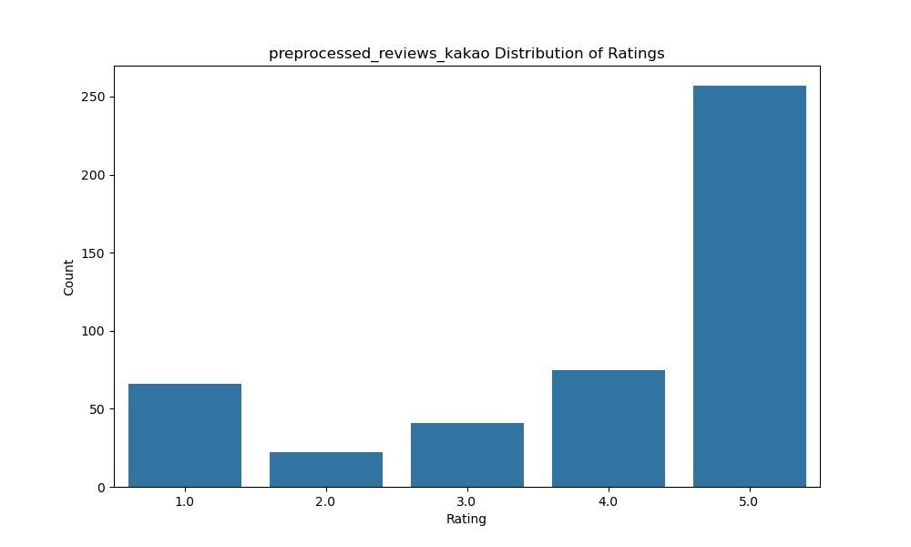
5점 평점이 250건 이상으로 압도적으로 많으며, 2점이 가장 적은 빈도를 보인다. 데이터가 고득점에 집중된 **긍정적 편향(Positive Bias)**을 띠고 있어, 전반적인 서비스 만족도가 높음을 시사한다.
### Google
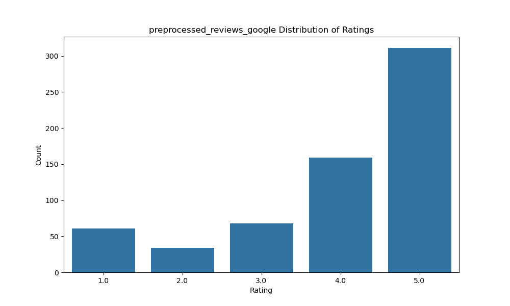
5점 평점이 250건 이상으로 압도적으로 많으며, 2점이 가장 적은 빈도를 보인다. 데이터가 고득점에 집중된 **긍정적 편향(Positive Bias)**을 띠고 있어, 전반적인 서비스 만족도가 높음을 시사한다.
### Tripdotcom
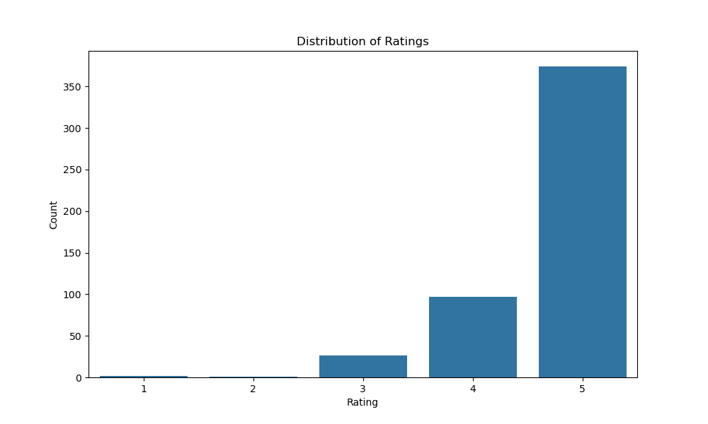
두 데이터 모두 5점 만점이 압도적으로 많으며, 고득점에 치중된 **긍정적 편향(Positive Bias)**을 보이고 있다. 이는 전반적인 서비스 만족도가 매우 높음을 시사하며, 데이터 정리를 통해 시각화가 가능해진 상태를 잘 보여준다.

## 전처리/FE
### Kakao

5점 리뷰의 비중이 가장 높아 전반적으로 이용자의 만족도가 높고, 1점과 5점에 리뷰가 집중되는 양극화된 분포가 관찰되었다.

PCA 결과, 설명된 분산은 2% 뿐이고 이는 텍스트 정보가 고차원에 분산되어 있음을 의미한다.
점들이 왼쪽에 몰려있고, 일부만 멀리 튀어나왔다. 대부분의 리뷰가 비슷한 단어 조합이고, 소수의 리뷰만 다른 단어를 사용함을 의미한다.
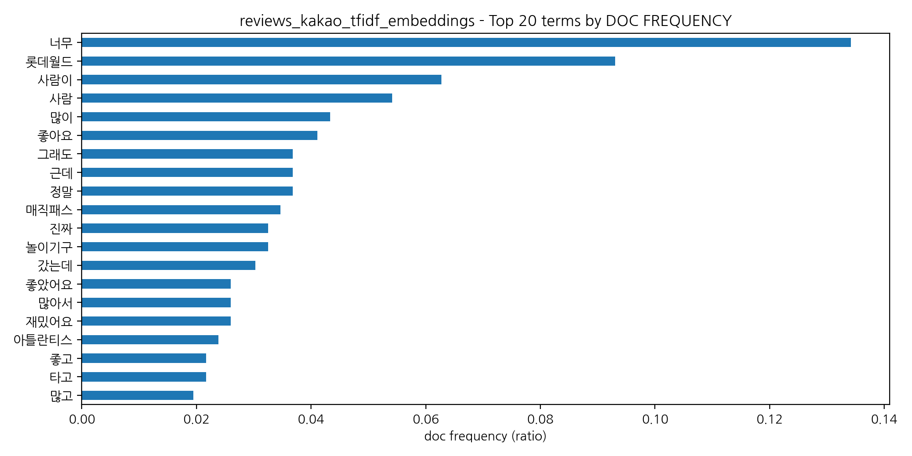
Doc frequency 상위 단어들은 ‘너무’, ‘좋아요’, ‘사람’ 등 많은 리뷰에서 반복되는 일반적인 감정 및 구어 표현이다. 플랫폼 특성을 반영한 공통 키워드로 볼 수 있다.
플랫폼 특성을 반영한 공통 키워드이다.
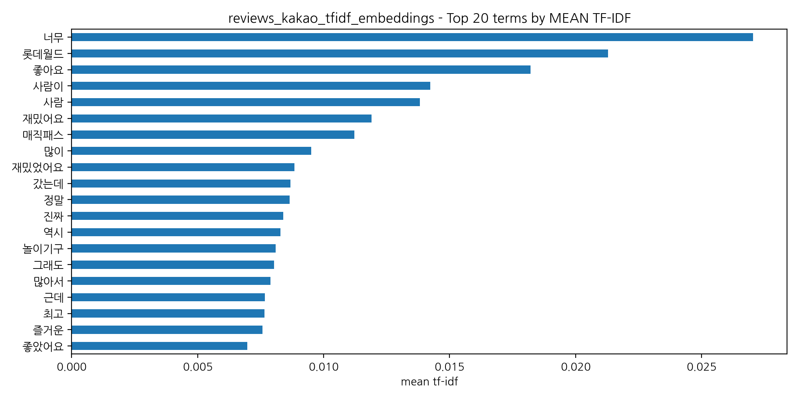
Mean TF-IDF 기준 상위 단어들은 ‘롯데월드’, ‘매직패스’, ‘놀이기구’ 등 리뷰의 핵심 경험과 직접적으로 연결된 단어들로, 카카오 리뷰의 주된 내용이 놀이공원 체험임을 보여준다.

### Google
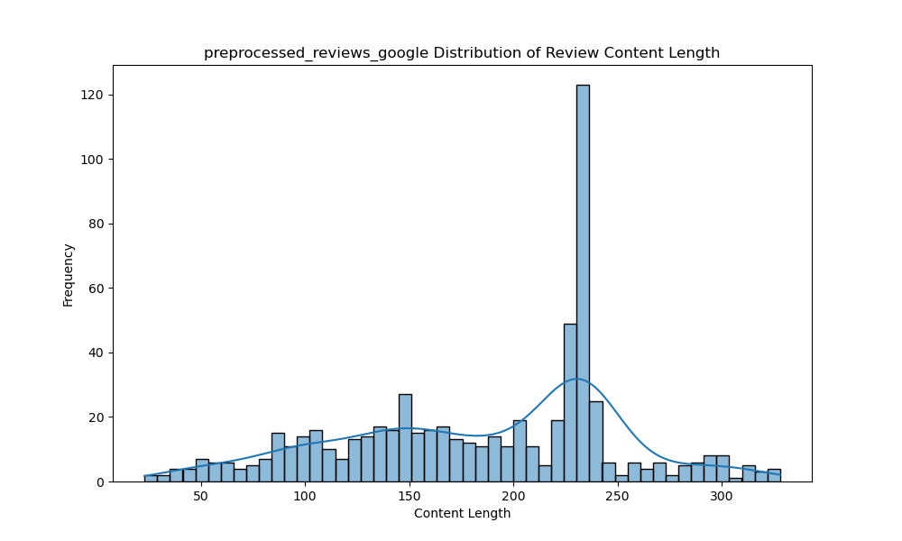
제공된 구글 리뷰 데이터는 20자에서 330자 사이의 분포를 보이며, 특히 150자와 230자 지점에서 정점을 형성하는 다봉형(Multimodal) 특성을 나타낸다. 그중에서도 230자 구간의 빈도수가 120회를 상회하며 압도적으로 높게 나타나는데, 이는 해당 데이터셋에서 230자 내외의 리뷰가 가장 지배적인 비중을 차지하고 있음을 시사한다.
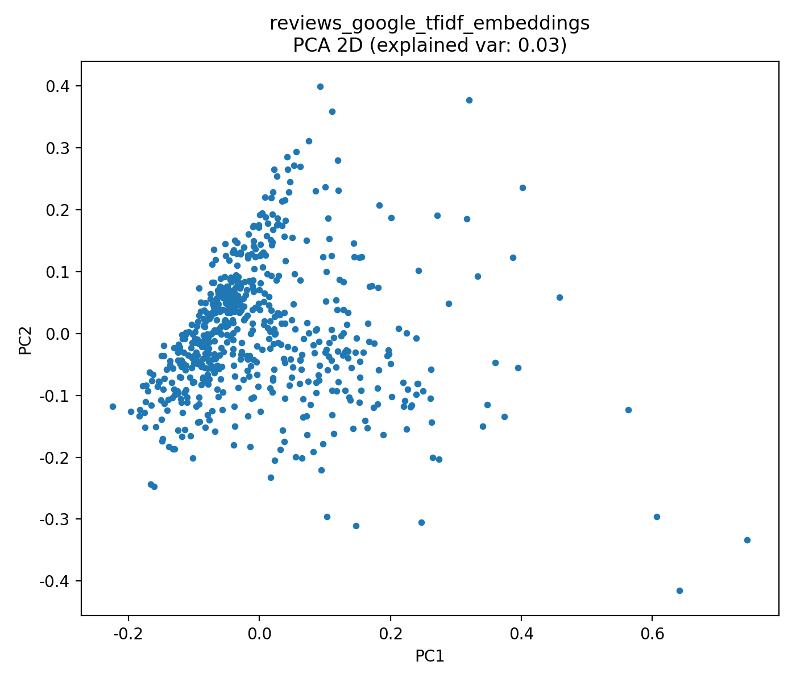

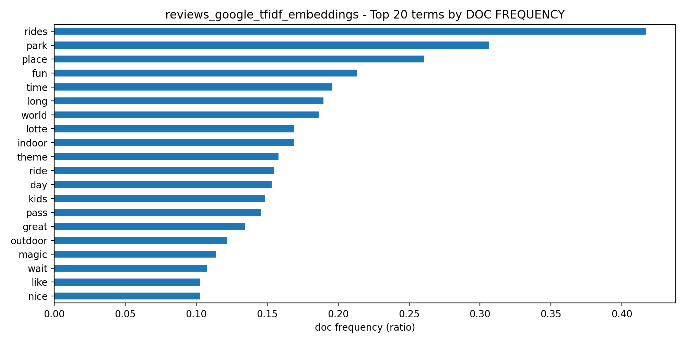
핵심 키워드: 'rides', 'park', 'place' 등 놀이공원 관련 단어가 높은 빈도로 등장하며, 'lotte', 'indoor', 'magic' 등을 통해 데이터의 출처가 롯데월드임을 알 수 있다.  
분포 및 군집: PCA 분석 결과 설명력(3%)이 낮고 데이터가 중앙에 밀집되어 있어, 리뷰 간 어휘 유사성이 매우 높고 뚜렷한 특징 기반의 군집 분리는 관찰되지 않는다.  
결론: 전반적으로 230자 내외의 리뷰가 주류를 이루며 주제가 일관적이다.


### Tripdotcom

대부분의 리뷰가 0~50자 사이의 짧은 길이로 작성되었음을 알 수 있다. 사용자들이 주로 간결한 후기를 남기는 경향이 높음을 시사한다.
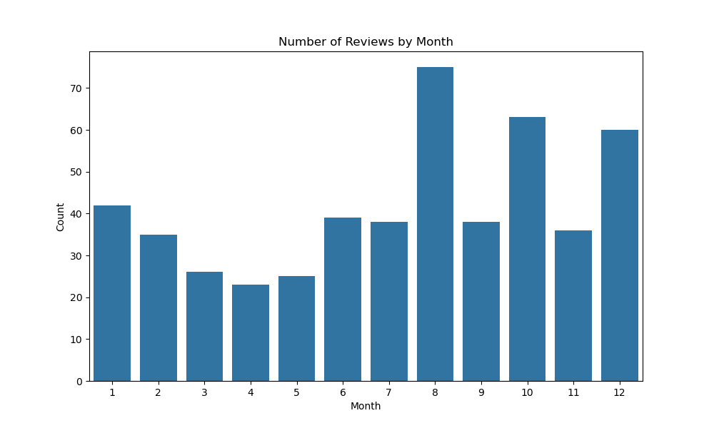
월별 작성된 리뷰의 개수를 보았을 때, 8월에 리뷰 수가 가장 높으며 10월과 12월에도 비교적 높은 수치를 기록한다. 이를 통해 여름 휴가철이나 연말 시즌에 방문이 활발해지는 패턴을 보여준다.
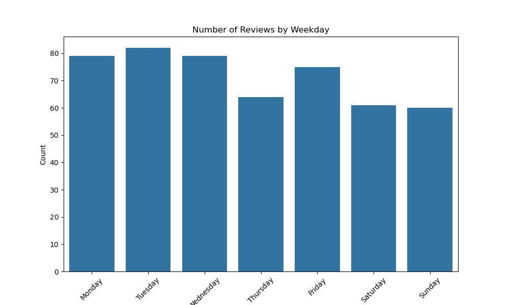
요일별 리뷰 등록 빈도를 비교했을 때, 비교적 월요일과 화요일에 리뷰가 가장 많이 등록된 것을 확인할 수 있다. 주말에 방문한 관람객들이 방문 직후인 주 초반에 후기를 남기는 사용자가 많음을 유추할 수 있다.
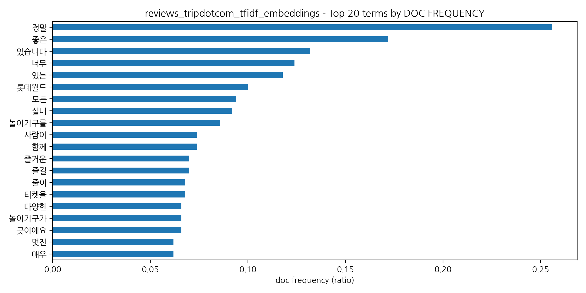
전체 리뷰 중 해당 단어가 포함된 리뷰의 비율이 높은 상위 20개 단어를 추출한 그래프이다. '정말', '좋은', '너무', '즐거운'과 같이 감정을 나타내는 부사나 형용사가 상위권을 차지하고 있다. 또한, 롯데월드와 관련된 '실내', '놀이기구' 등의 키워드를 통해 데이터의 정체성을 파악할 수 있다.

PCA 분석 결과 설명된 분산이 5% 정도라는 점은 리뷰들이 고차원에 분포되어 있음을 의미한다. 점들의 분포를 보아 대부분의 리뷰가 비슷한 단어 조합이고, 소수의 리뷰만 다른 단어를 사용함을 알 수 있다.

## 비교분석
*구글 데이터의 날짜가 ‘YYYY-MM-DD’ 형식이 아니라 ‘n년 전’과 같은 상대적인 표현으로 제공된다.  
이에 따라 데이터 처리 시점을 기준으로 해당 값을 과거 연도로 변환하여 날짜 변수를 생성하였다
(예: 처리 시점 기준 ‘5년 전’ → 2020년).
이러한 특성으로 인해 시계열 분석에서는 구글 데이터를 포함하지 않았다.
### 텍스트 분석
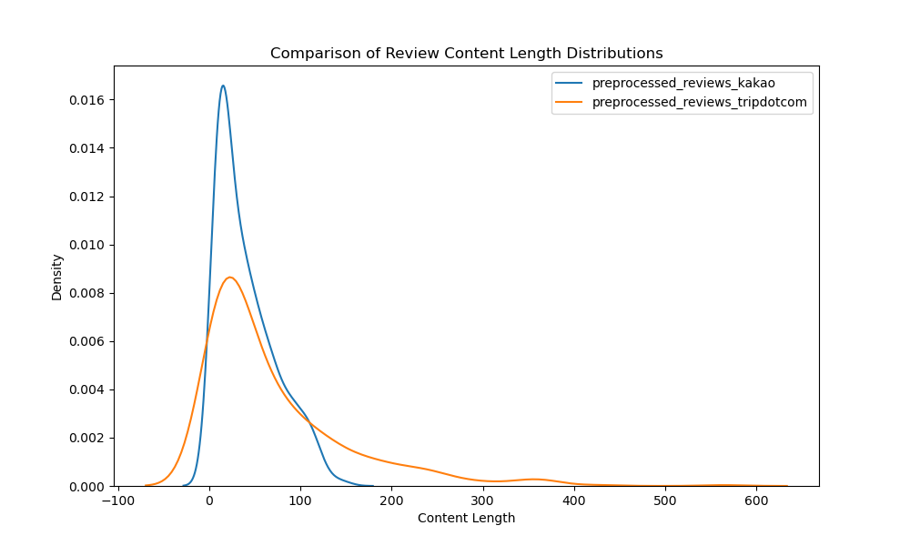
각 사이트에 올라온 리뷰들의 길이를 비교한 그래프이다.
 - 카카오에서 작성된 대다수의 리뷰는 20자 이내로 집중되어 있어, 짧은 감상 위주의 플랫폼 문화가 반영된 것으로 볼 수 있다.
 - 트립닷컴의 경우 카카오보다 피크가 낮고 분포가 더 넓게 퍼져 있다. 대다수의 유저가 리뷰를 짧게 쓰지만, 일부 사용자는 100자 이상의 상세한 경험을 공유하는 경향이 있다.
 - 구글은 다른 두 사이트와 달리 피크가 230~250자 부근에서 가장 높게 나타난다. 한글과 영어의 정보 밀도 때문에 영어로 작성된 구글 리뷰의 평균 길이가 길어졌다고 해석할 수 있다. 또한, 구글의 경우 타 사이트에 비해 상세한 가이드를 작성하려는 성격이 강해 리뷰가 긴 것으로 판단할 수도 있다.

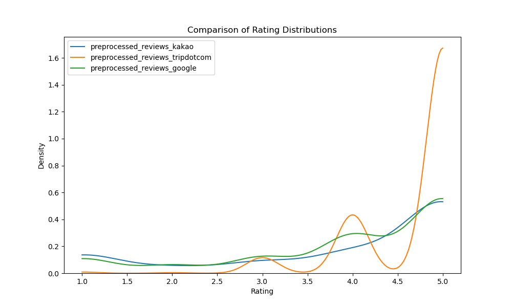
세 사이트의 평점 분포를 비교한 그래프이다. 세 사이트 모두 고득점에 리뷰가 쏠려있는 긍정적 편향 현상이 뚜렷하게 나타난다.
   - 트립닷컴의 경우 5점에 대한 비율이 압도적으로 높아 그래프의 밀도가 5점에서 가장 가파르게 솟아 있다. 타 사이트에 비해 중간 점수(2~3점) 비율이 낮다.
   - 구글과 카카오의 경우 트립닷컴에 비해서는 평점이 조금 더 분산되어 있으나 여전히 대부분의 평점이 4점 이상에 편중되어 있다.
### 시계열 분석
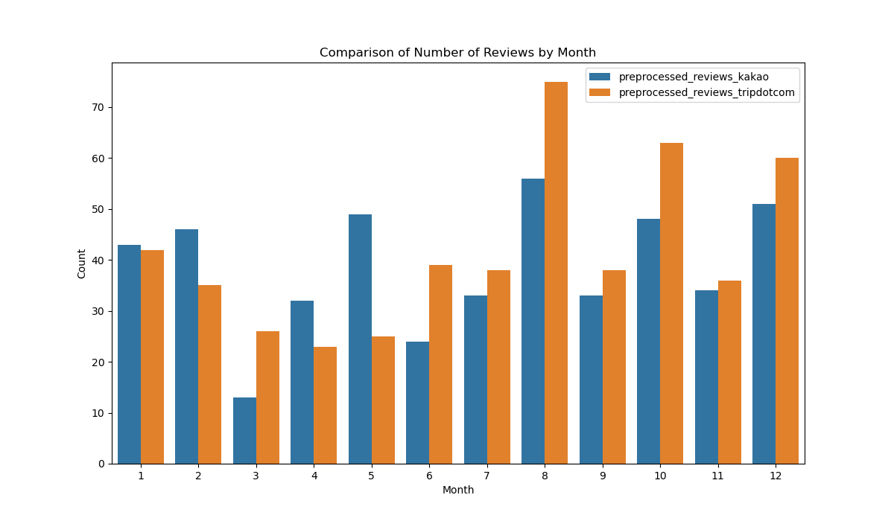
 - 두 사이트 모두에서 8월에 리뷰 수가 가장 압도적으로 높게 나타난다. 8월은 전형적인 여름 휴가 및 방학 시즌으로 국내외 관광객의 방문이 이 시기에 집중되기 때문으로 유추할 수 있다.
 - 10월과 12월에도 리뷰 수가 다시 상승하는 흐름을 보이는데, 이는 롯데월드의 대표적인 이벤트가 10월 할로윈 및 12월 크리스마스에 진행되기 때문이라고 볼 수 있다.
 - 카카오맵의 경우 1, 2월 및 5월에도 비교적 리뷰 수가 높은데, 연초는 겨울 휴가 및 방학 시즌으로 방문객이 몰리는 것으로 유추해볼 수 있다. 5월은 현장체험학습 등 행사가 많아 방문객이 늘어난 것을 시사한다.
 - 반면 4월은 개학 직후이자 대형 축제가 적은 시기로, 상대적으로 리뷰 수가 적다.  

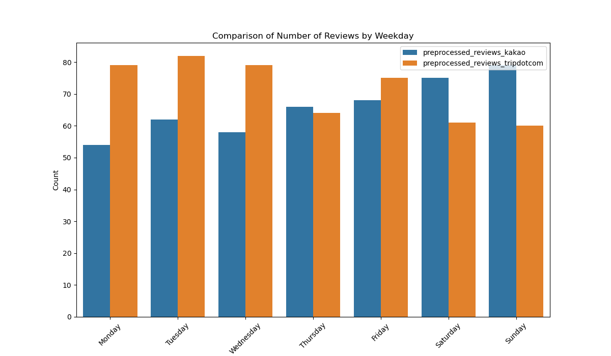
 - 카카오맵의 경우 주말에 가까워질수록 리뷰 수가 많아지고, 트립닷컴의 경우 그래프상 주 초반(월, 화, 수)에 등록된 리뷰 수가 비교적 많다.
 - 카카오맵의 리뷰 추이는 주말에 놀이공원에 방문하는 사람이 많다는 직관과 맞아떨어진다.
 - 트립닷컴에서 주말의 리뷰 수가 상대적으로 적은 것과 대조해 볼 때, 사람들은 주말에 롯데월드를 방문한 후 주 초반에 여유를 가지고 리뷰를 작성하는 경향이 있는 것으로 보인다.
