# YBIGTA 4th team
Team lead: 신영군
Team member: 배순은 양진완

# Team Information
we good

# Member Introduction
신영군: YBIGTA 28기 신영군입니다! 반갑습니다  
양진완: YBIGTA 28기 양진완입니다! 화이팅해봐요  
배순은: YBIGTA 28기 배순은입니다! 파이팅입니다ㅠㅠ!  

# Github homework image
branch protection(branch rule)
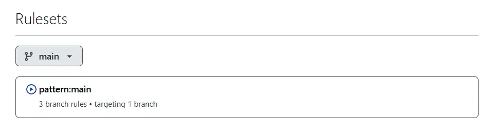
rejected push request
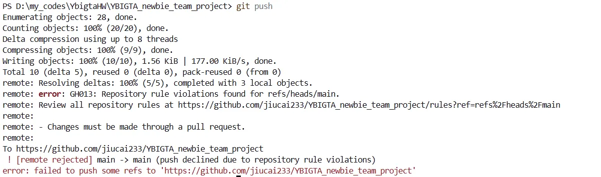
review and merge
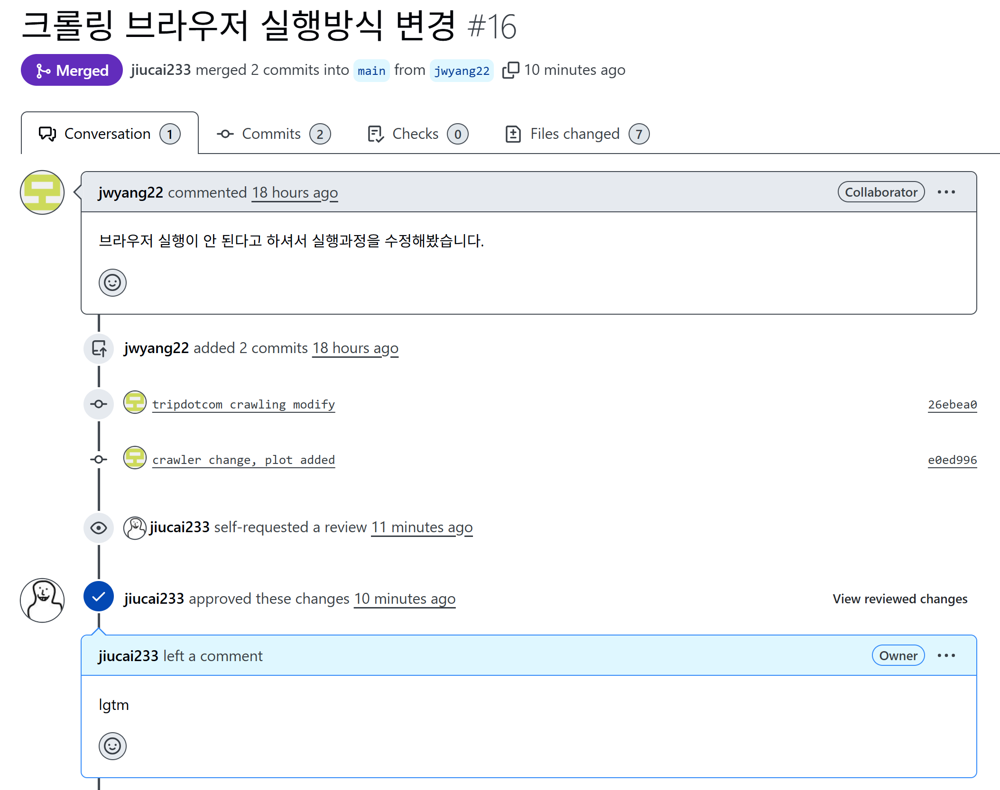

# 코드 실행 방법

## 환경 준비

1. 터미널 또는 Powershell 열기
2. 경로 설정 (YBIGTA_newbie_team_project 루트폴더)
3. 필요한 패키지 설치
```bash
pip install -r requirements.txt
```
## WEB 과제
```bash
# http://127.0.0.1:8000/docs 에서 API 확인
uvicorn app.main:app --reload
```
## 크롤링
```bash
cd review_analysis/crawling
python main.py --output_dir ../../database --all
```

## EDA/FE
```bash
cd review_analysis/preprocessing  
python main.py --output_dir ../../database --all
```

# 데이터 소개 
서울 잠실동에 있는 놀이공원인 '롯데월드'의 리뷰를 세 사이트에서 크롤링 및 분석하고자 하였다. 
#### 크롤링한 사이트 링크
   - 구글맵: https://www.google.com/maps/place/Lotte+World/data=!4m12!1m2!2m1!1sLotte+World!3m8!1s0x357ca5a7250efe81:0x433df2c1fec03b98!8m2!3d37.5111158!4d127.098167!9m1!1b1!15sCgtMb3R0ZSBXb3JsZCIDiAEBWg0iC2xvdHRlIHdvcmxkkgEKdGhlbWVfcGFya-ABAA!16zL20vMDNqbGo5?hl=en&entry=ttu&g_ep=EgoyMDI2MDExMy4wIKXMDSoKLDEwMDc5MjA3M0gBUAM%3D  
   - 카카오맵: https://place.map.kakao.com/27560699
   - 트립닷컴: https://kr.trip.com/travel-guide/attraction/seoul/lotte-world-adventure-136469953/
#### 데이터 형식
    - 사이트별 크롤링 결과를 각각의 csv 파일로 저장
#### 데이터 개수
    - 구글맵: 776개
    - 카카오맵: 661개
    - 트립닷컴: 500개

## 전처리/FE
### 결측치
   - `rating`, `review`, `date` 컬럼에서 결측치가 있는 행 제거
### 이상치
   - 별점이 1부터 5까지의 정수가 아닌 경우 데이터 제거  
### 텍스트데이터 전처리
   - 이모티콘 등과 같은 특수문자 제거 및 불필요한 공백 삭제  
### 파생변수
   - 리뷰 길이
   - 긍정/부정 여부(별점이 4점 이상일 경우 긍정으로 분류)
   - 시계열분석을 위한 '월' 및 '요일' 변수
### 텍스트 벡터화 (TF-IDF)
   리뷰 텍스트를 TF-IDF 방식으로 벡터화하여 각 리뷰를 단어 가중치 벡터로 표현했다. 이렇게 만든 TF-IDF 임베딩(embedding) CSV를 기반으로 
   (1) 평균 TF-IDF가 큰 상위 단어, 
   (2) 문서 등장 비율이 큰 상위 단어를 시각화하고, 
   (3) 벡터의 희소도(sparsity) 및 리뷰당 유효 단어 수 같은 기본 통계를 확인했다. 
   또한 PCA 2차원 산점도로 임베딩 분포를 살펴보았고, 사이트가 2개 이상일 경우 사이트 간 단어집합 교집합/합집합 및 Jaccard 유사도, 공통 단어의 평균 TF-IDF 차이가 큰 단어들을 비교 분석했다. 
   결과(그래프 PNG)는 review_analysis/plots/에 저장했다.

# 시각화 도표 및 설명
## EDA
### Kakao
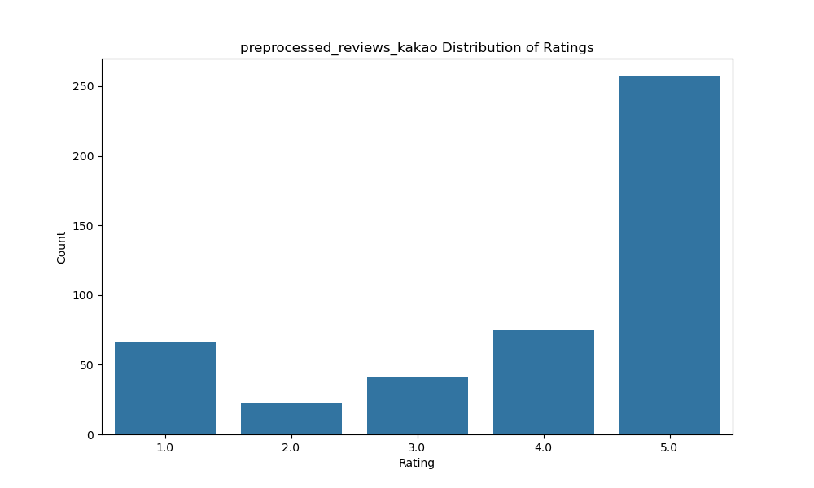
5점 평점이 250건 이상으로 압도적으로 많으며, 2점이 가장 적은 빈도를 보인다. 데이터가 고득점에 집중되어 있으면서도 1점의 비율이 낮지 않다.
### Google
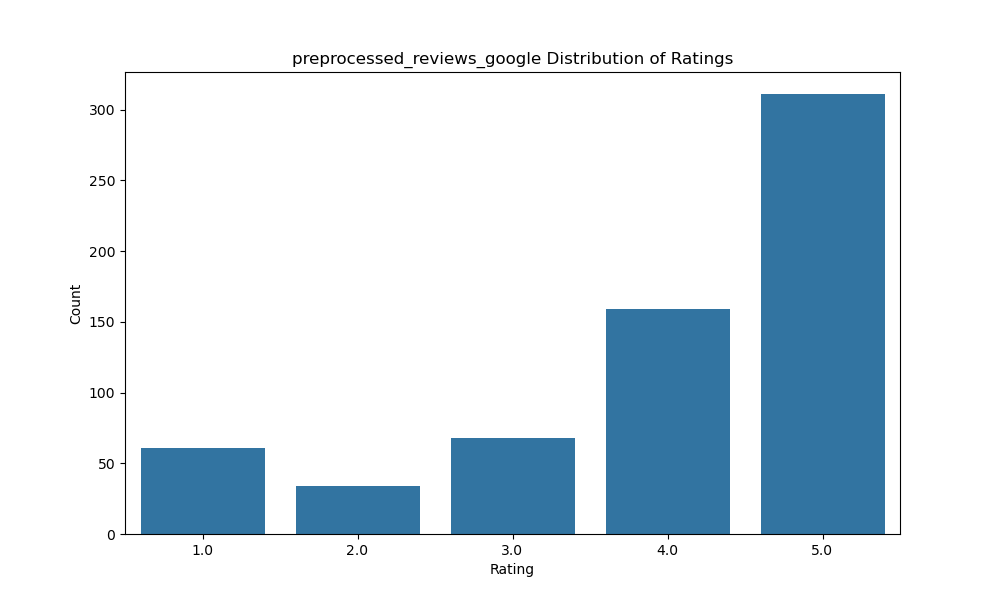
5점 평점이 250건 이상으로 압도적으로 많으며, 2점이 가장 적은 빈도를 보인다. 4점 이상의 평점이 카카오에 비해 많아 긍정적인 리뷰가 상대적으로 많음을 볼 수 있다.
### Tripdotcom
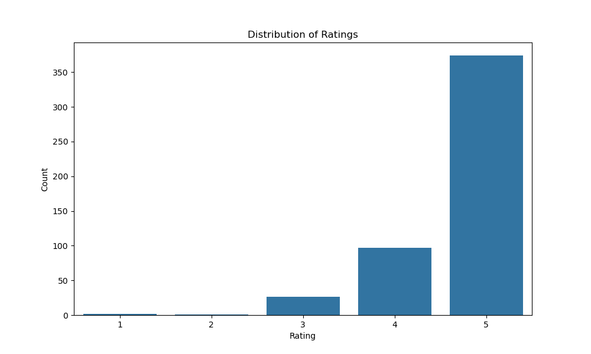
두 데이터에 비해 5점 만점이 압도적으로 많아 고득점에 치중된 긍정적 편향(Positive Bias)을 보이고 있다. 이는 전반적인 서비스 만족도가 매우 높음을 시사한다.

## 전처리/FE
### Kakao

5점 리뷰의 비중이 가장 높아 전반적으로 이용자의 만족도가 높고, 1점과 5점에 리뷰가 집중되는 양극화된 분포가 관찰되었다.
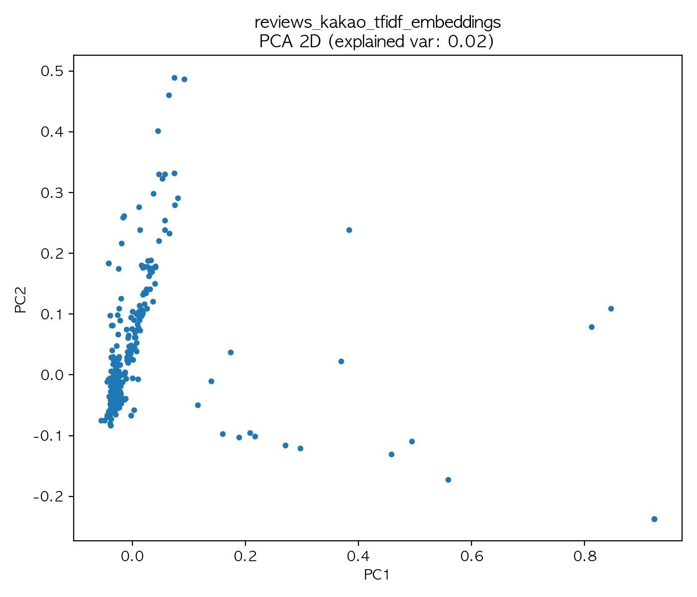
PCA 결과, 설명된 분산은 2% 뿐이고 이는 텍스트 정보가 고차원에 분산되어 있음을 의미한다.
점들이 왼쪽에 몰려있고, 일부만 멀리 튀어나왔다. 대부분의 리뷰가 비슷한 단어 조합이고, 소수의 리뷰만 다른 단어를 사용함을 의미한다.
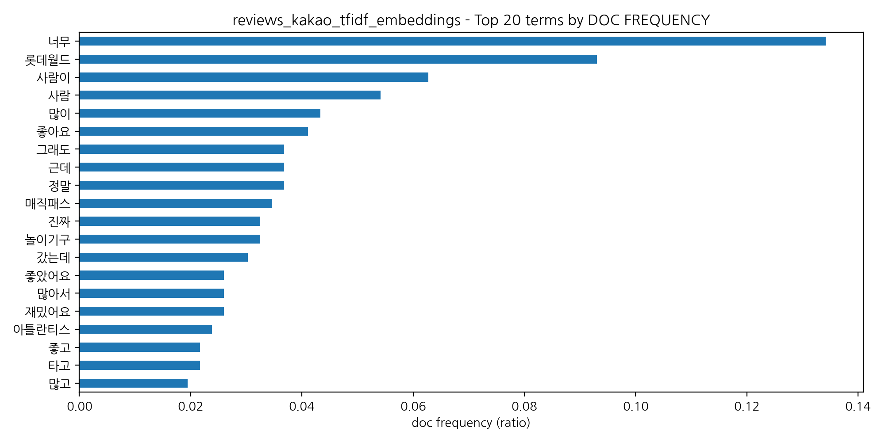
Doc frequency 상위 단어들은 ‘너무’, ‘좋아요’, ‘사람’ 등 많은 리뷰에서 반복되는 일반적인 감정 및 구어 표현이다. 플랫폼 특성을 반영한 공통 키워드로 볼 수 있다.
플랫폼 특성을 반영한 공통 키워드이다.
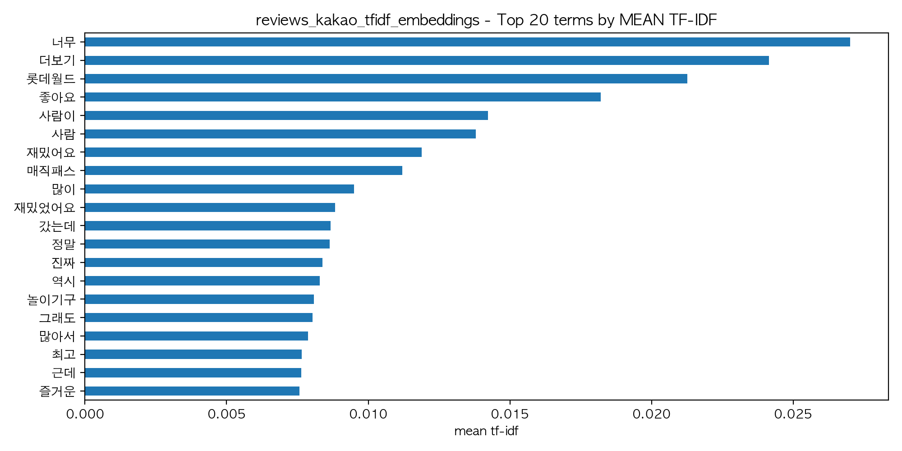
Mean TF-IDF 기준 상위 단어들은 ‘롯데월드’, ‘매직패스’, ‘놀이기구’ 등 리뷰의 핵심 경험과 직접적으로 연결된 단어들로, 카카오 리뷰의 주된 내용이 놀이공원 체험임을 보여준다.

### Google
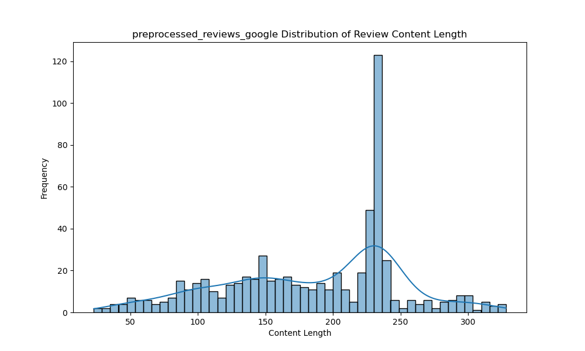
제공된 구글 리뷰 데이터는 20자에서 330자 사이의 분포를 보이며, 특히 150자와 230자 지점에서 정점을 형성하는 다봉형(Multimodal) 특성을 나타낸다. 그중에서도 230자 구간의 빈도수가 120회를 상회하며 압도적으로 높게 나타나는데, 이는 해당 데이터셋에서 230자 내외의 리뷰가 가장 지배적인 비중을 차지하고 있음을 시사한다.
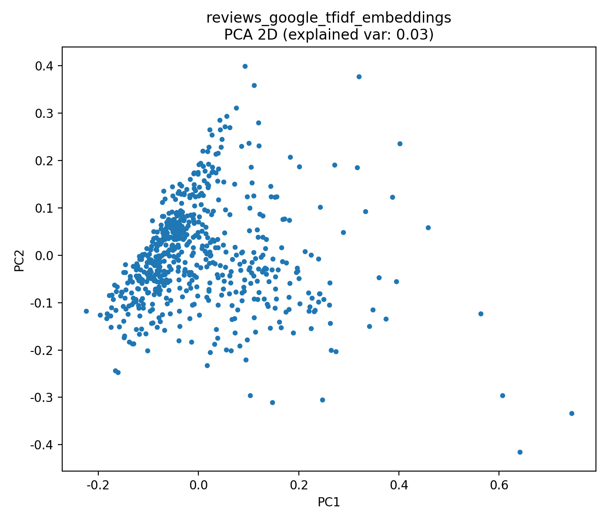

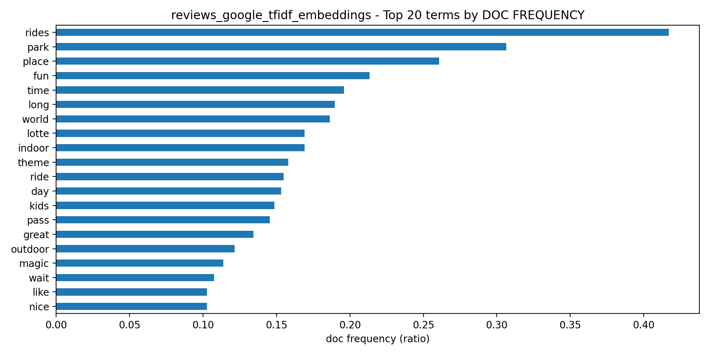
핵심 키워드: 'rides', 'park', 'place' 등 놀이공원 관련 단어가 높은 빈도로 등장하며, 'lotte', 'indoor', 'magic' 등을 통해 데이터의 출처가 롯데월드임을 알 수 있다.  
분포 및 군집: PCA 분석 결과 설명력(3%)이 낮고 데이터가 중앙에 밀집되어 있어, 리뷰 간 어휘 유사성이 매우 높고 뚜렷한 특징 기반의 군집 분리는 관찰되지 않는다.  
결론: 전반적으로 230자 내외의 리뷰가 주류를 이루며 주제가 일관적이다.


### Tripdotcom
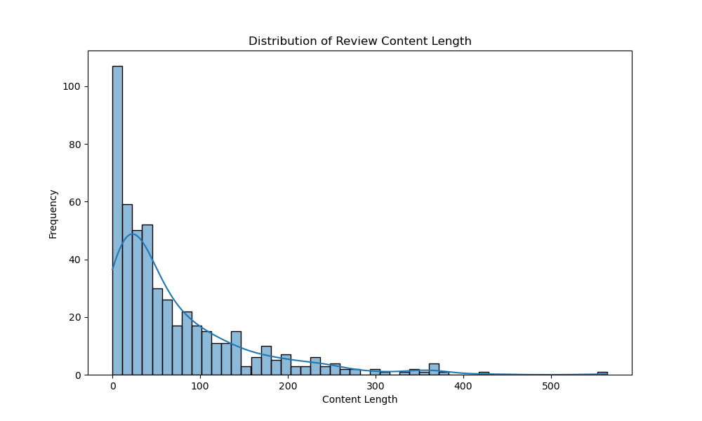
대부분의 리뷰가 0~50자 사이의 짧은 길이로 작성되었음을 알 수 있다. 사용자들이 주로 간결한 후기를 남기는 경향이 높음을 시사한다.
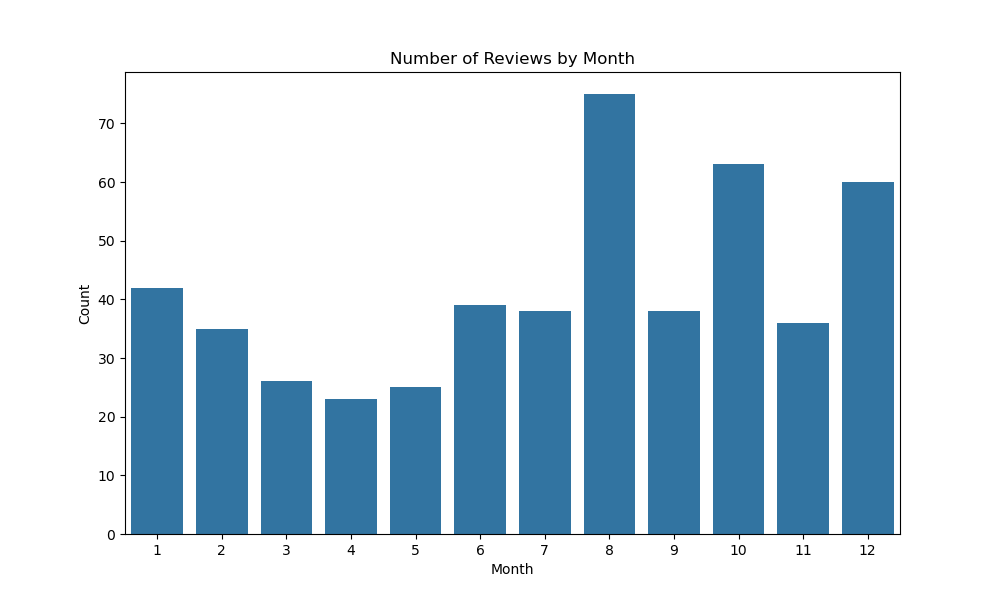
월별 작성된 리뷰의 개수를 보았을 때, 8월에 리뷰 수가 가장 높으며 10월과 12월에도 비교적 높은 수치를 기록한다. 이를 통해 여름 휴가철이나 연말 시즌에 방문이 활발해지는 패턴을 보여준다.
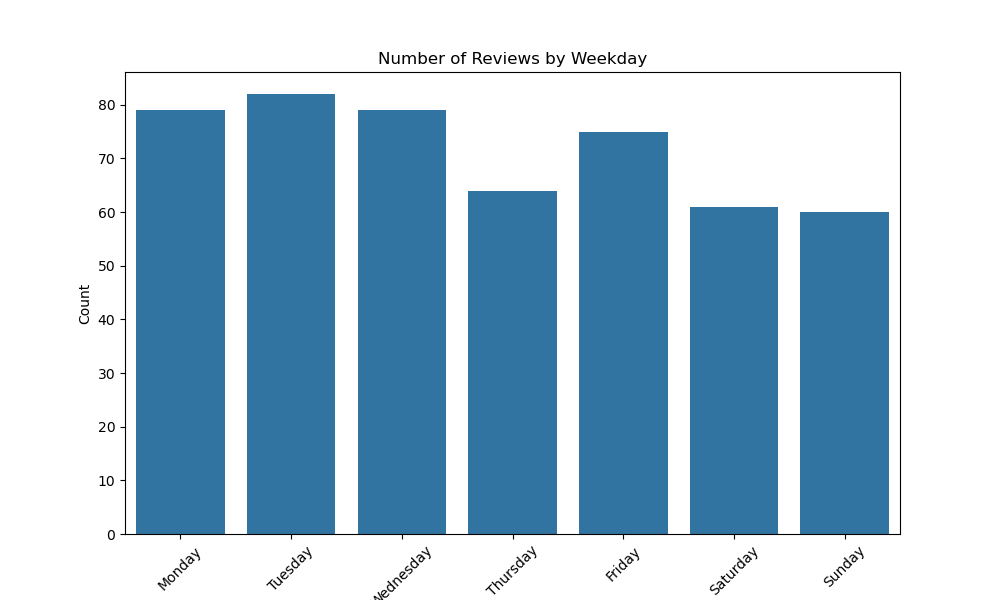
요일별 리뷰 등록 빈도를 비교했을 때, 비교적 월요일과 화요일에 리뷰가 가장 많이 등록된 것을 확인할 수 있다. 주말에 방문한 관람객들이 방문 직후인 주 초반에 후기를 남기는 사용자가 많음을 유추할 수 있다.
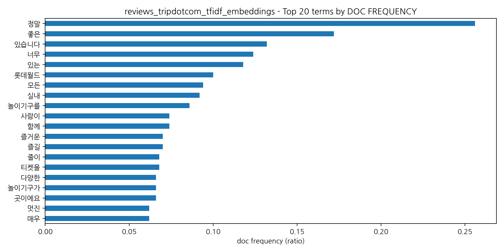
전체 리뷰 중 해당 단어가 포함된 리뷰의 비율이 높은 상위 20개 단어를 추출한 그래프이다. '정말', '좋은', '너무', '즐거운'과 같이 감정을 나타내는 부사나 형용사가 상위권을 차지하고 있다. 또한, 롯데월드와 관련된 '실내', '놀이기구' 등의 키워드를 통해 데이터의 정체성을 파악할 수 있다.
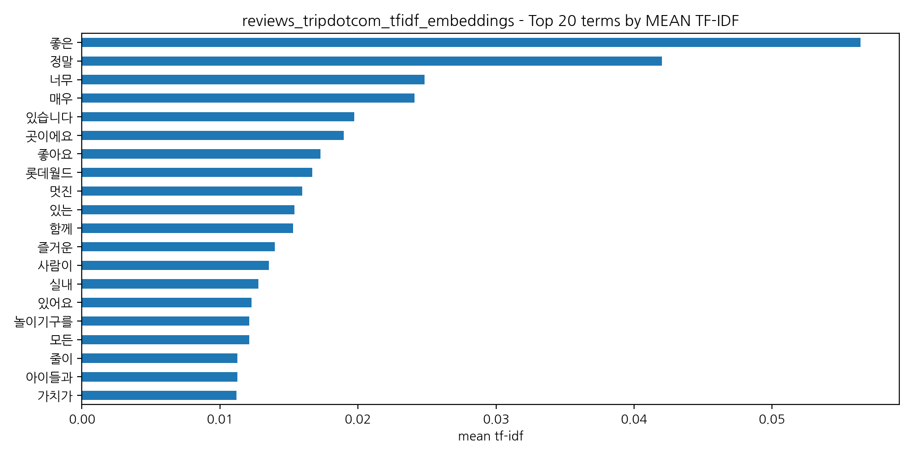
PCA 분석 결과 설명된 분산이 5% 정도라는 점은 리뷰들이 고차원에 분포되어 있음을 의미한다. 점들의 분포를 보아 대부분의 리뷰가 비슷한 단어 조합이고, 소수의 리뷰만 다른 단어를 사용함을 알 수 있다.

## 비교분석
*구글 데이터의 날짜가 ‘YYYY-MM-DD’ 형식이 아니라 ‘n년 전’과 같은 상대적인 표현으로 제공된다.  
이에 따라 데이터 처리 시점을 기준으로 해당 값을 과거 연도로 변환하여 날짜 변수를 생성하였다
(예: 처리 시점 기준 ‘5년 전’ → 2020년).
이러한 특성으로 인해 시계열 분석에서는 구글 데이터를 포함하지 않았다.
### 텍스트 분석
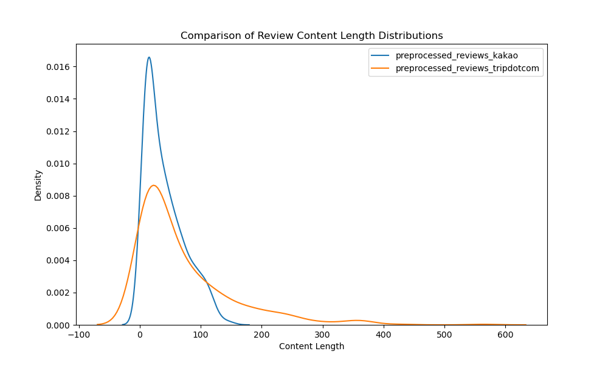
각 사이트에 올라온 리뷰들의 길이를 비교한 그래프이다.
 - 카카오에서 작성된 대다수의 리뷰는 20자 이내로 집중되어 있어, 짧은 감상 위주의 플랫폼 문화가 반영된 것으로 볼 수 있다.
 - 트립닷컴의 경우 카카오보다 피크가 낮고 분포가 더 넓게 퍼져 있다. 대다수의 유저가 리뷰를 짧게 쓰지만, 일부 사용자는 100자 이상의 상세한 경험을 공유하는 경향이 있다.
 - 구글은 다른 두 사이트와 달리 피크가 230~250자 부근에서 가장 높게 나타난다. 한글과 영어의 정보 밀도 때문에 영어로 작성된 구글 리뷰의 평균 길이가 길어졌다고 해석할 수 있다. 또한, 구글의 경우 타 사이트에 비해 상세한 가이드를 작성하려는 성격이 강해 리뷰가 긴 것으로 판단할 수도 있다.

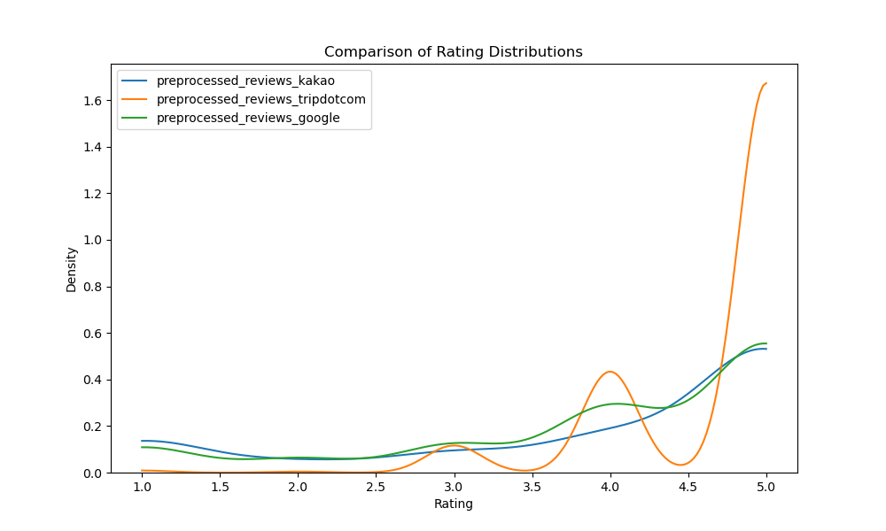
세 사이트의 평점 분포를 비교한 그래프이다. 세 사이트 모두 고득점에 리뷰가 쏠려있는 긍정적 편향 현상이 뚜렷하게 나타난다.
   - 트립닷컴의 경우 5점에 대한 비율이 압도적으로 높아 그래프의 밀도가 5점에서 가장 가파르게 솟아 있다. 타 사이트에 비해 중간 점수(2~3점) 비율이 낮다.
   - 구글과 카카오의 경우 트립닷컴에 비해서는 평점이 조금 더 분산되어 있으나 여전히 대부분의 평점이 4점 이상에 편중되어 있다.
### 시계열 분석
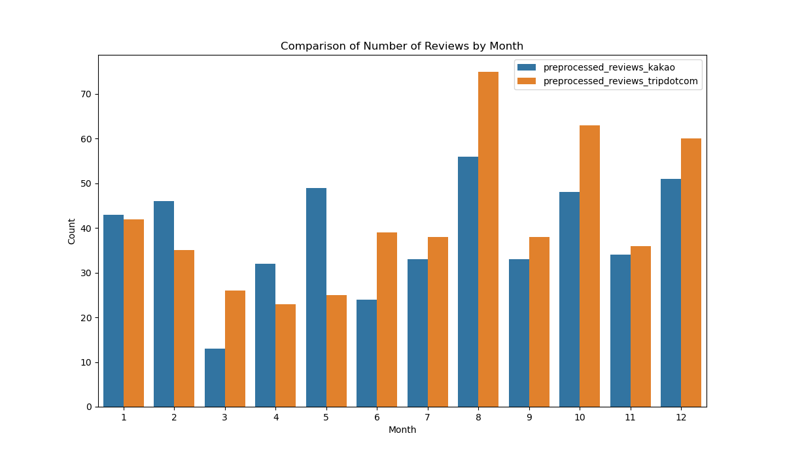
 - 두 사이트 모두에서 8월에 리뷰 수가 가장 압도적으로 높게 나타난다. 8월은 전형적인 여름 휴가 및 방학 시즌으로 국내외 관광객의 방문이 이 시기에 집중되기 때문으로 유추할 수 있다.
 - 10월과 12월에도 리뷰 수가 다시 상승하는 흐름을 보이는데, 이는 롯데월드의 대표적인 이벤트가 10월 할로윈 및 12월 크리스마스에 진행되기 때문이라고 볼 수 있다.
 - 카카오맵의 경우 1, 2월 및 5월에도 비교적 리뷰 수가 높은데, 연초는 겨울 휴가 및 방학 시즌으로 방문객이 몰리는 것으로 유추해볼 수 있다. 5월은 현장체험학습 등 행사가 많아 방문객이 늘어난 것을 시사한다.
 - 반면 4월은 개학 직후이자 대형 축제가 적은 시기로, 상대적으로 리뷰 수가 적다.  

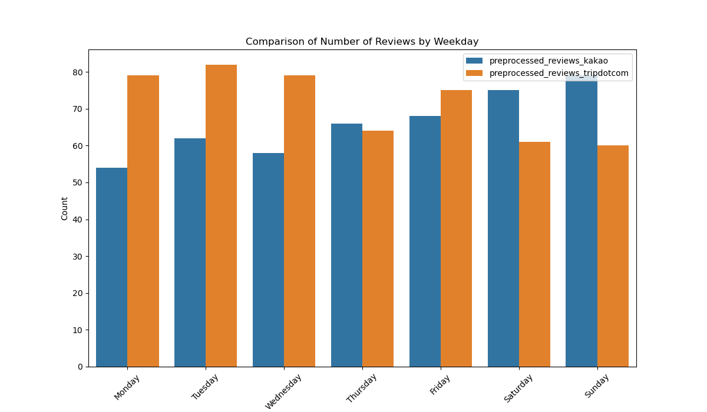
 - 카카오맵의 경우 주말에 가까워질수록 리뷰 수가 많아지고, 트립닷컴의 경우 그래프상 주 초반(월, 화, 수)에 등록된 리뷰 수가 비교적 많다.
 - 카카오맵의 리뷰 추이는 주말에 놀이공원에 방문하는 사람이 많다는 직관과 맞아떨어진다.
 - 트립닷컴에서 주말의 리뷰 수가 상대적으로 적은 것과 대조해 볼 때, 사람들은 주말에 롯데월드를 방문한 후 주 초반에 여유를 가지고 리뷰를 작성하는 경향이 있는 것으로 보인다.

# DB, Docker, AWS
Dockerhub주소: https://hub.docker.com/repository/docker/jiucai233/ybigta_newbie_team_project
## AWS
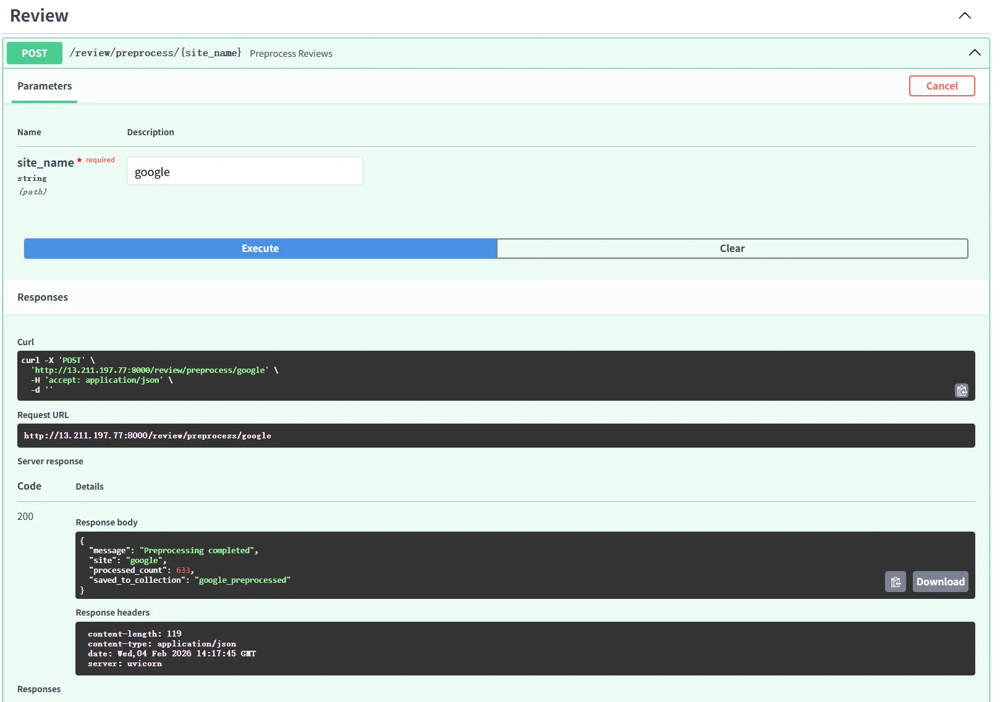
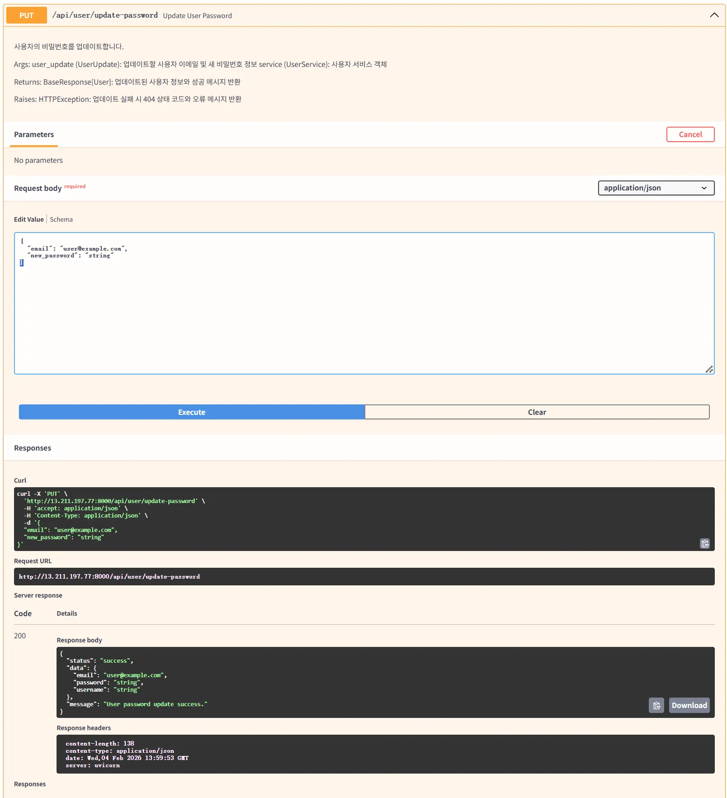
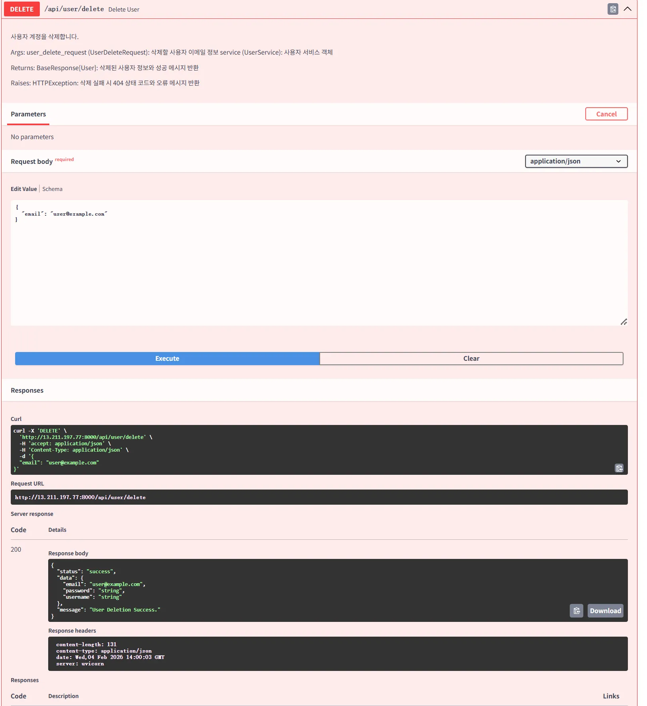
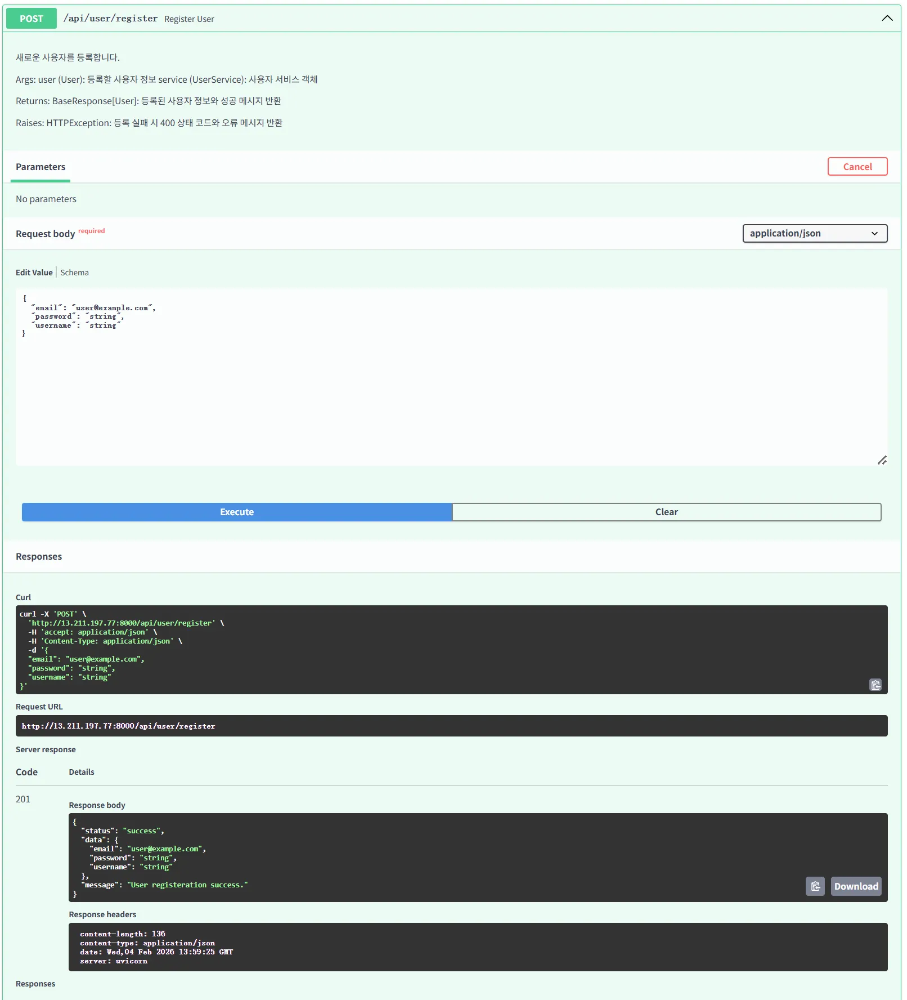
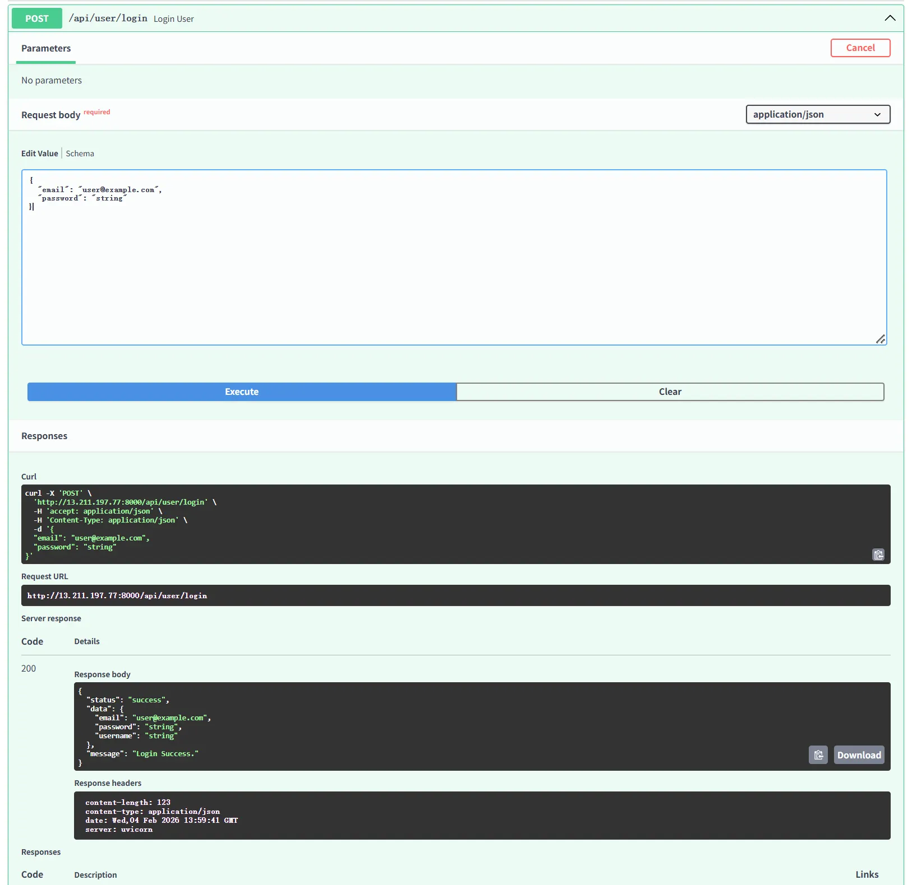
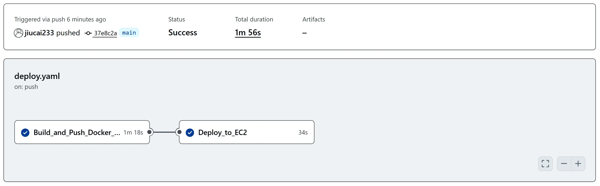

## RDS, Load Balancer
### RDS보호
RDS는 데이터베이스를 위한 서비스로, EC2와 연결이 가능하며 각종 백업, 확장, 로그 기능을 제공한다. 인프라 기초 구축 및 연결 측면에서 RDS는 매우 실용적인 도구다.RDS는 DBMS를 기반으로 생성된 하나의 인스턴스로 볼 수 있으므로, 인바운드(Inbound)와 아웃바운드(Outbound)에 대한 제한이 존재하다. AWS에는 EC2와 RDS를 클릭 한 번으로 연결해주는 기능이 있으며, 저는 이 기능을 활용했다.
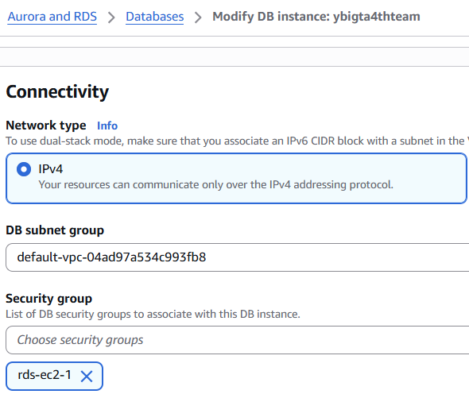
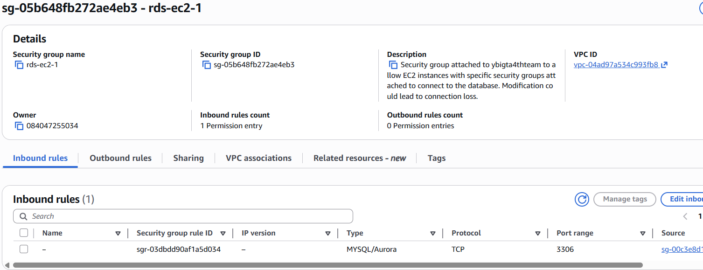
이미지에 나타난 바와 같이, RDS에는 클릭 한 번으로 자동 생성된 `rds-ec2-1`이라는 명칭의 보안 그룹(SG)이 활성화되어 있다.
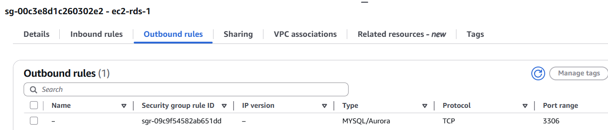
또한 EC2 보안 그룹 규칙의 경우, 아웃바운드(Outbound)가 3306번 포트로 전용 설정되어 있다. 이는 오직 해당 EC2 인스턴스만이 이 데이터베이스(DB)에 접근할 수 있음을 보장한다.
### EC2 port protection with Load Balancer
ALB(Application Load Balancer)의 주요 기능은 크게 두 가지이다. 첫째, 여러 EC2 인스턴스로 요청을 할당(Allocate)하는 것이며, 둘째, 타겟 그룹(Target Group)과 보안 그룹(SG)을 생성 및 적용하여 EC2 인스턴스의 포트를 보호하는 것이다. 여기서 타겟 그룹이란 말 그대로 ALB가 요청을 전달할 대상 인스턴스의 리스트를 의미한다.
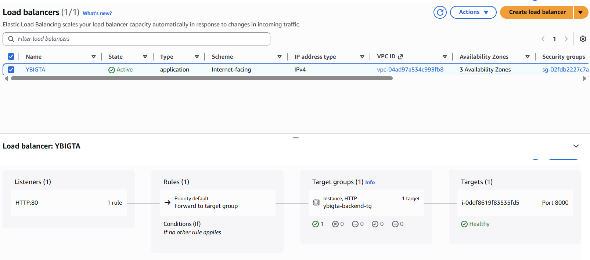
이미지에서 확인 가능하듯이, ALB는 보안 그룹을 통해 80번 포트로부터 들어오는 모든 요청을 리스닝한다. 이후 해당 요청을 타겟 그룹 내의 대상 인스턴스로 전달한다. 결과적으로 EC2 인스턴스의 보안 그룹 규칙은 오직 ALB로부터 오는 인바운드 요청만을 수락하도록 변경되어야 한다.
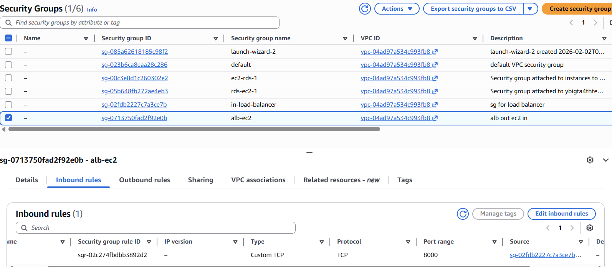
인바운드 규칙이 ALB의 보안 그룹 ID인 `sg-02fdb...`로부터의 요청만을 수용하도록 설정된 것을 쉽게 확인할 수 있다. 이는 결과적으로 EC2의 포트를 외부 노출로부터 성공적으로 보호하고 있음을 의미한다.
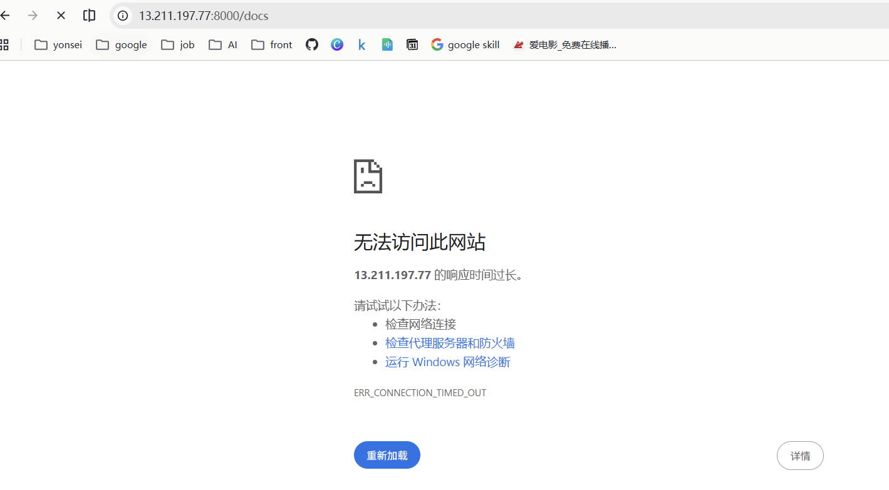
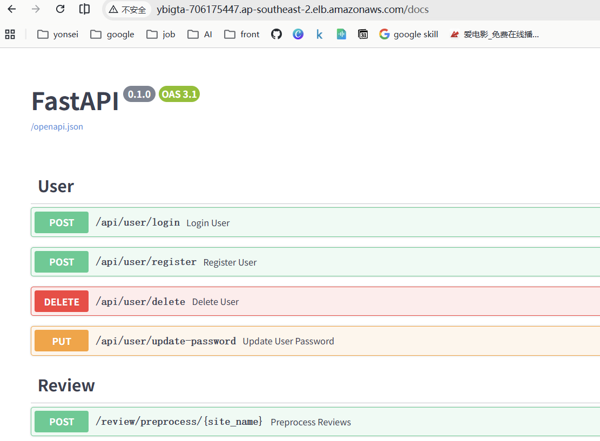
또한 EC2의 퍼블릭 IP로 직접 접속했을 때 발생하는 에러 메시지를 통해, 이러한 보안 조치가 성공적으로 적용되었음을 확인할 수 있다.

### 마주쳤던 오류
1. 클라우드 네트워크 및 보안 아키텍처 (Networking & Security)
외부 트래픽 유입부터 내부 리소스 간 통신까지, 가장 핵심적인 "링크 연결" 단계에서 발생한 이슈들이었다.

| 도전 과제 (Challenge) | 근본 원인 (Root Cause) | 해결 방안 (Resolution) |
|----------------------|----------------------|----------------------|
| 대상 그룹(Target Group) 'Unused' 상태 | 가용 영역(AZ) 불일치: EC2는 `2c`에 있으나, ALB 생성 시 `2a`, `2b` 서브넷만 선택되어 트래픽 전달 불가. | 네트워크 매핑 수정: ALB 설정에서 해당 인스턴스가 포함된 모든 서브넷을 체크하여 교차 가용 영역 프로브 활성화. |
| ALB 도메인 접속 타임아웃 | 보안 그룹(SG) 설정 오류: 80(HTTP) 포트 개방 규칙을 트래픽 입구인 ALB가 아닌 RDS 보안 그룹에 잘못 적용. | 3계층 분리 적용: ALB 전용 보안 그룹에서 `0.0.0.0/0` 대상 80 포트를 개방하여 외부 입구 확보. |
| 백엔드 포트 은닉 (Port Isolation) | 보안 규정상 외부에서 `IP:8000`으로 ALB를 우회하여 직접 접속하는 것을 차단해야 함. | 보안 그룹 상호 참조 (Referencing): EC2 보안 그룹의 인바운드 규칙을 ALB 보안 그룹 ID로부터의 8000 포트 트래픽만 허용하도록 수정. |
| RDS 연결 지속 타임아웃 | 소스 주소 검증 실패: 네트워크(연세대 WiFi 등) 공망 IP 변경으로 인해 기존 고정 IP 권한이 무효화됨. | 내장 신뢰 설정: RDS 보안 그룹의 인바운드 소스를 EC2 보안 그룹 ID로 지정하여 안정적인 내원 통신 구현. |

2. Docker 이미지 배포 및 환경 최적화 (Docker & OS)
이미지 용량 과부하 및 권한 문제 등 로컬에서 클라우드로 넘어가는 과정의 최적화 단계입니다.

| 도전 과제 (Challenge) | 근본 원인 (Root Cause) | 해결 방안 (Resolution) |
|----------------------|----------------------|----------------------|
| .pem 키 권한 오류 | 파일 시스템 매핑 실책: WSL 마운트 경로(`/mnt/d/`)는 Linux의 `chmod 400` 권한 설정을 완벽히 지원하지 않음. | 경로 이전: 키 파일을 Linux 네이티브 홈 디렉토리(`~/.ssh/`)로 이동 후 권한 수정. (초기 개발 단계)|
| 반복적인 sudo 사용 | 사용자 권한 미부여: 현재 사용자가 `docker` 그룹에 포함되지 않아 매번 루트 권한 필요. | 그룹 권한 부여: `sudo usermod -aG docker $USER` 실행 후 세션 재접속. |
| 이미지 용량 과다 (2GB+) | 의존성 중복 및 컨텍스트 과다: 불필요한 파일과 모든 종속성을 한 레이어에 `COPY`하여 용량 급증. | 멀티 스테이지 빌드: 빌드 환경과 런타임 환경을 분리하여 최종 이미지 경량화. Linux환경에서 필요한 페키지(fastapi등)만 설치, 용량은 원래의 5.78GB부터 293까지 감소함
### 개발 중 깨달은 점과 개념 정리
1. 보안 그룹 참조 (Security Group Referencing) vs IP 화이트리스트
개념: 접속 허용 기준을 특정 '소스 IP(0.0.0.0/0 또는 고정 IP)'가 아닌 '소스의 신원(SG ID)'으로 설정하는 방식임.

심층 이해: 동적인 클라우드 환경에서 IP는 유동적(예: 연세대학교 WiFi 공인 IP 변동)이지만, 보안 그룹 ID는 고유하며 정적임. RDS 보안 그룹이 EC2 보안 그룹을 신뢰하도록 설정함으로써 '신원 계약' 기반의 내장 신뢰 체계를 구축함. 이를 통해 네트워크 환경 변화에 따른 연결 중단 문제를 근본적으로 해결함.

2. 로드 밸런서 기반 '3계층 격리' 아키텍처
트래픽 흐름: Internet → ALB (80) → Target Group → EC2 (8000) → RDS (3306).

계층별 직무:

ALB (Application Load Balancer): 외부와 통신하는 유일한 관문이며, 외부로부터의 부하를 수용하고 분산함.

EC2 (Computing Layer): 프라이빗 신뢰 사슬 뒤에 보호받는 순수 계산 계층임.

RDS (Database Layer): 데이터의 핵심부로서 외부로부터의 직접적인 접근을 엄격히 차단함.

논리적 폐쇄성: 포트 은닉(Port Isolation)이 이루어지지 않은 상태의 ALB 도입은 보안상 무의미함. 즉, 모든 백엔드 접점은 오직 로드 밸런서를 통해서만 연결되어야 함.

💡 프로젝트 수행을 통한 주요 인사이트
1. 학생 과제와 실무 배포의 본질적 차이
단순히 코드를 클라우드에 올리는 '학생 수준의 과제'와 실제 사용자를 대상으로 하는 '서비스 배포'는 차원이 다른 영역임.

실제 서비스 단계에서는 단순 기능 구현을 넘어, 외부 공격 방어(Security) 및 효율적인 트래픽 분산(Traffic Distribution)이 필수적으로 고려되어야 함.

2. 정밀 기기로서의 소프트웨어 시스템
성공적인 서비스 배포를 위해서는 전체 시스템이 마치 정교하게 설계된 정밀 기기처럼 유기적으로 맞물려 돌아가야 함을 체감함.

인프라의 세밀한 설정(포트 하나, 보안 그룹 규칙 하나)이 전체 서비스의 생존과 직결됨을 인식함.

3. 클라우드 서비스(CSP) 활용의 중요성
AWS, GCP와 같은 클라우드 서비스 제공업체는 이러한 정교한 시스템을 안정적으로 구축할 수 있도록 돕는 강력한 도구임.

성능과 보안이 보장된 인프라를 구축하기 위해서는 클라우드 서비스의 특성을 깊이 있게 이해하고 활용하는 능력이 필수적임.